# AlgoVis
 A python visualiser for various Algorithms

# GUI

- GUI built using streamlit
- To use app locally,
    - Clone the repo and run [StartUI.sh](StartUI.sh) to view the app on your browser!
- App is hosted at [Streamlit](https://kausikn-algovis.streamlit.app/)
- App can also be run on my [Common Host App](https://kausikn-commonhostapp.streamlit.app/),
    - Choose settings from the left tab dropdown and select "Add New Repo" under Select Setting dropdown
    - Type the repo name and click on "Add Repo"
    - Goto Choose Project from the left tab dropdown, choose the project and click load and deploy.
    - Then go ahead and use the app! 😃
    - If you want to change to another app, simply click on View Other Projects in top left and choose any other project and load and deploy.

# AlgoVis
## K-Means Clustering
- Visualise K-Means Clustering algorithm over iterations
    
    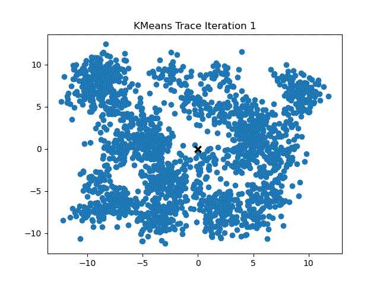

## Random Number Generation
- Visualise Output Distribution on python's inbuilt Random Function
    
    
    
## Sorting Algorithms Visualiser
Visualise sorting procedures for various sorting algorithms

- Bubble Sort
    
    

- Insertion Sort
    
    

- Selection Sort
    
    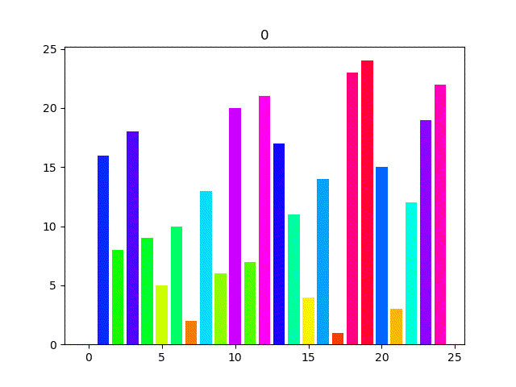

- Merge Sort
    
    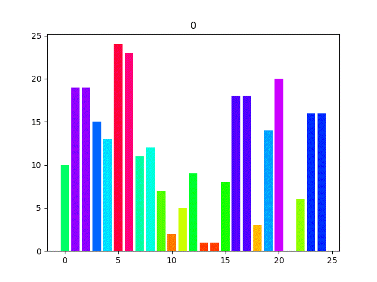

## Collatz Conjecture
- Visualise Collatz Conjecture Convergence
    
    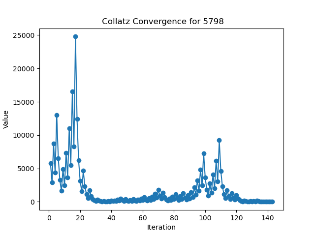
    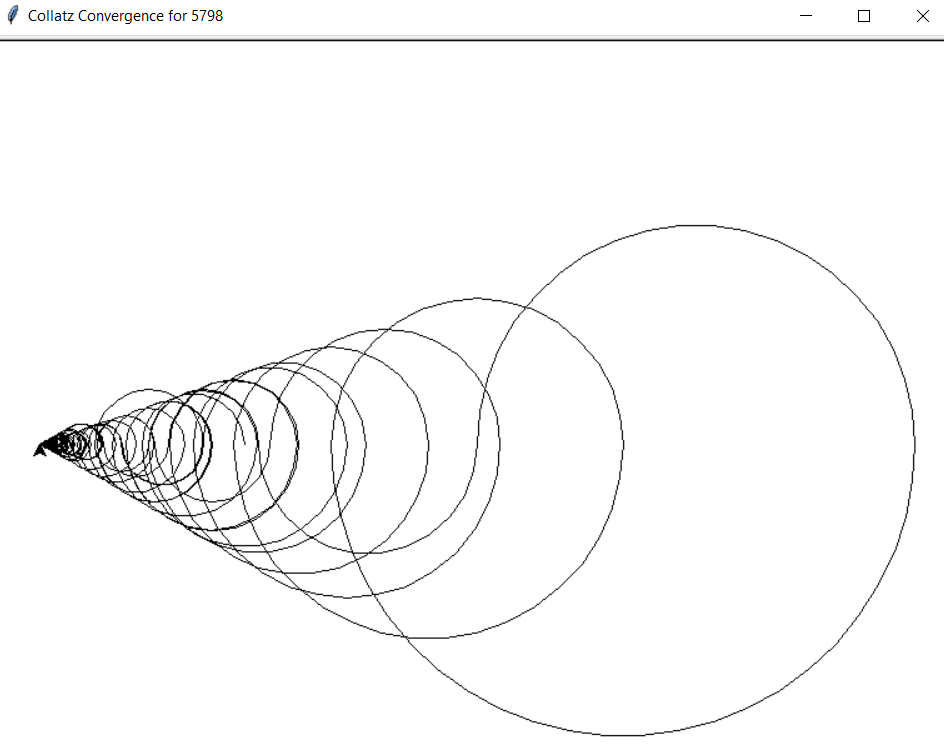
    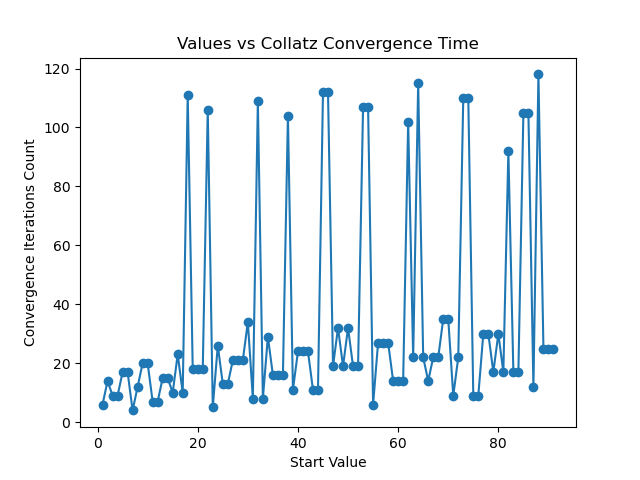

- Video on Collatz Conjecture
    
    
    
## Bifurcate Population Convergence
- Visualise Bifurcate Population Convergence
    
    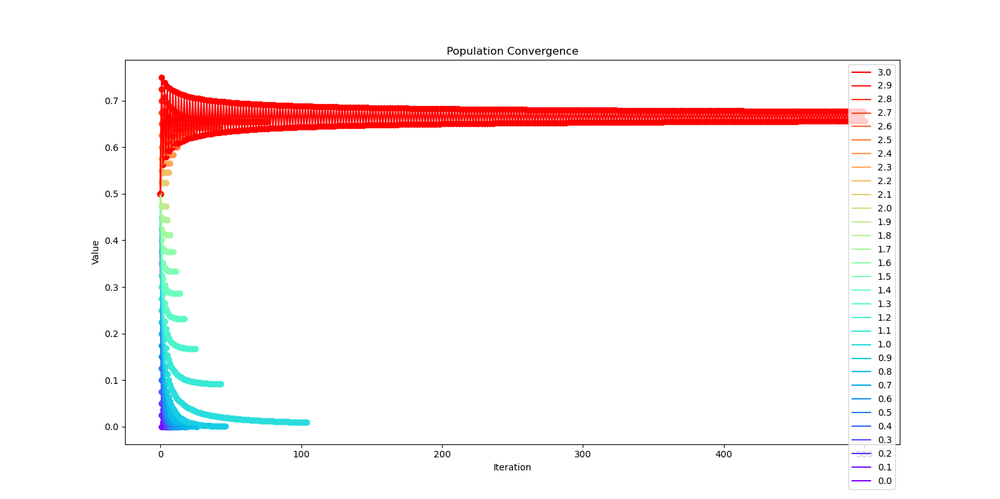
    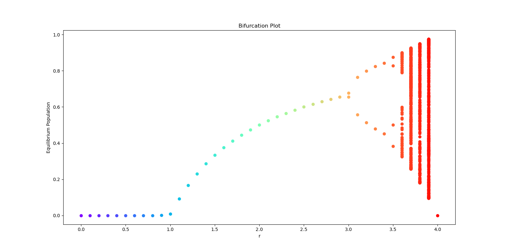

- Video on Bifurcate Population Conjecture
    
    

## Recaman Sequence
- Visualise Recaman Sequence
    
    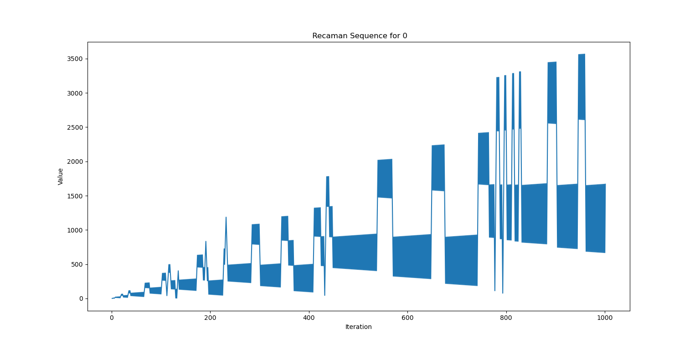
    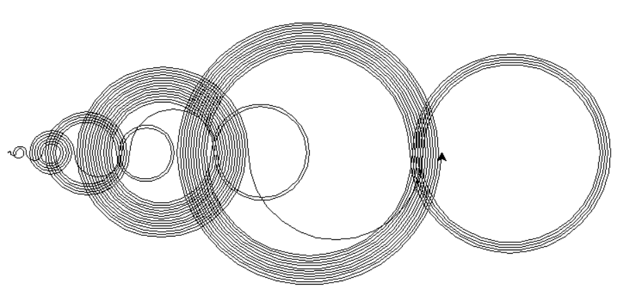
        
- Video on Recaman Sequence
    
    

## Fibonacci Sequence
- Visualise Fibonacci Sequence and its variants
    
- Standard Fibonacci Sequence

    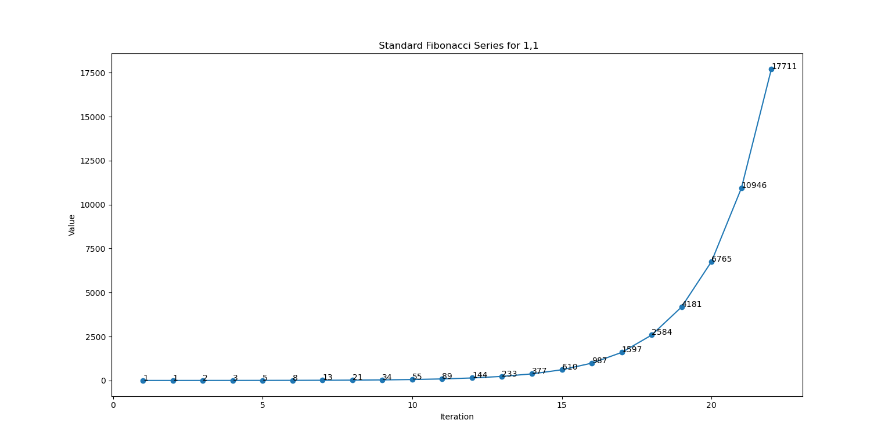
    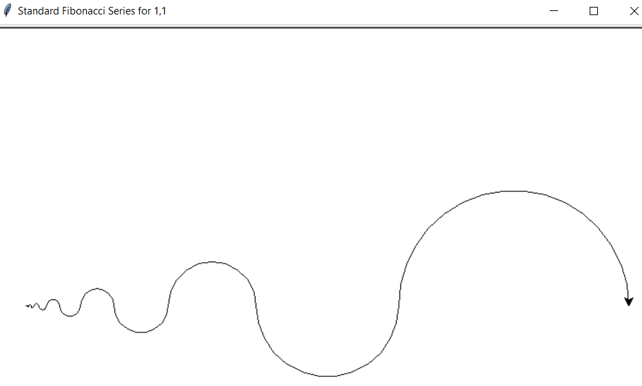

- General Length Fibonacci Sequence

    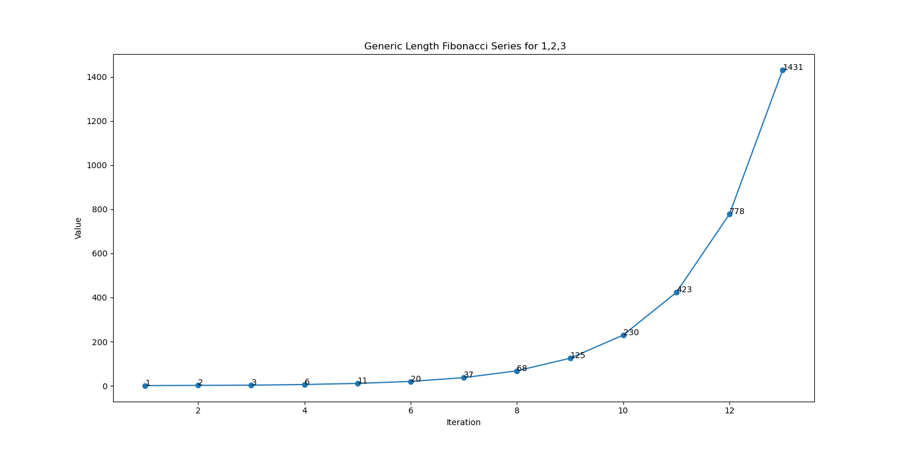
    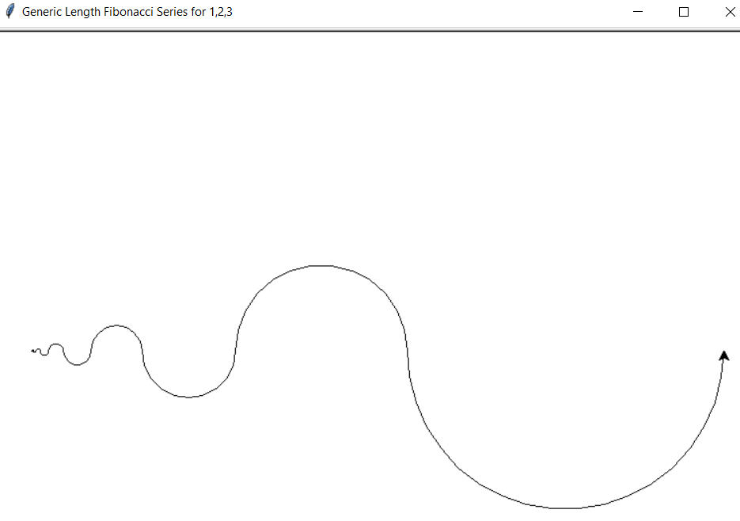

- Custom Function Fibonacci Sequence - Here used Reverse Fibonacci Function

    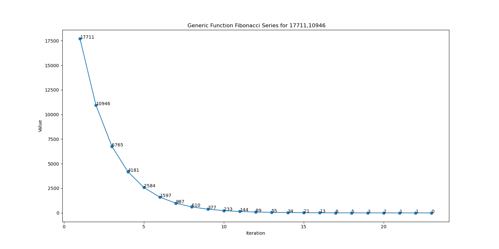
    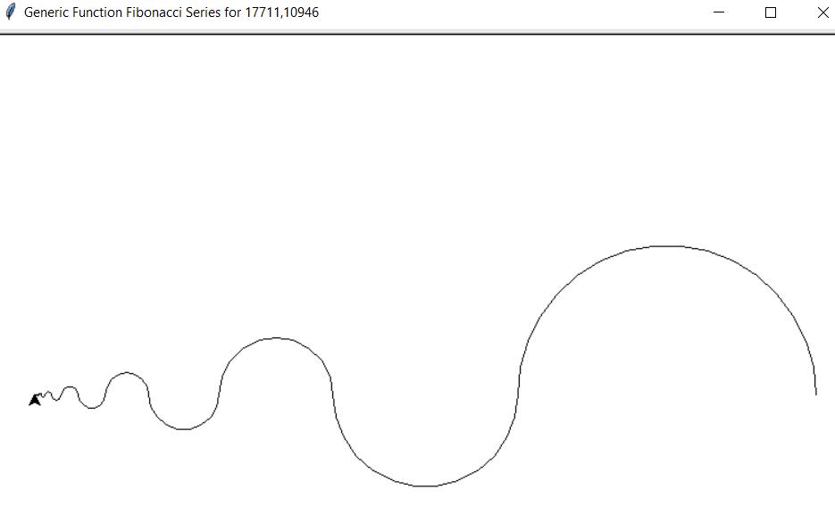

- Video on Fibonacci Sequence
    
    
    
## Digit Sum and Multiply Convergence
- Visualise Digit Sum and Multiply Convergence
    
    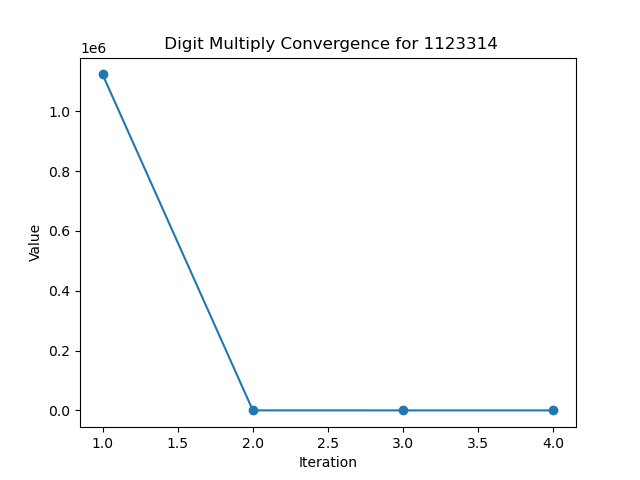
    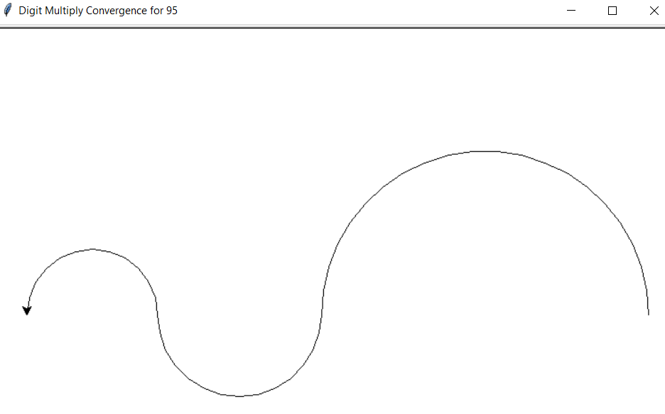
    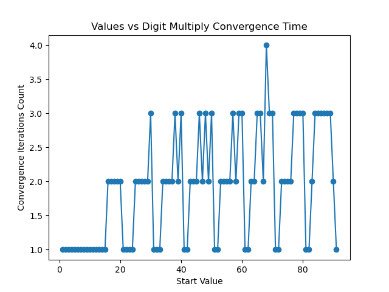