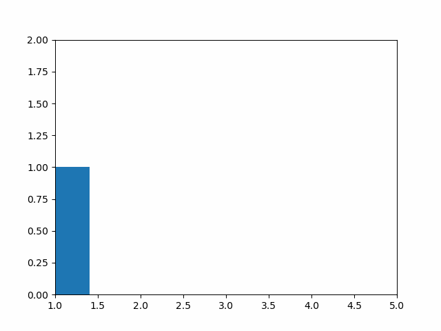

# AlgoVis
 A python visualiser for various Algorithms

# GUI

 - GUI built using streamlit
 - To use app locally,
    - Clone the repo and run [StartUI.sh](StartUI.sh) to view the app on your browser!
 - App is also hosted remotely on heroku using my common host app,
    - [https://infinityjoker-apps.herokuapp.com/](https://infinityjoker-apps.herokuapp.com/)

    - In the Common Host App, simply choose a project to load and click load and deploy.

    - Then go ahead and use the app! :)

    - If you want to change to another app, simply click on View Other Projects in top left and choose any other project and load and deploy.

# AlgoVis
## K-Means Clustering
   - Visualise K-Means Clustering algorithm over iterations
   
   

## Random Number Generation
   - Visualise Output Distribution on python's inbuilt Random Function
   
   
   
## Sorting Algorithms Visualiser
   Visualise sorting procedures for various sorting algorithms

   - Bubble Sort
   
   

   - Insertion Sort
   
   

   - Selection Sort
   
   

   - Merge Sort
   
   

## Collatz Conjecture
   - Visualise Collatz Conjecture Convergence
   
   
   
   

   - Video on Collatz Conjecture
   
   
   
## Bifurcate Population Convergence
   - Visualise Bifurcate Population Convergence
   
   
   

   - Video on Bifurcate Population Conjecture
   
   

## Recaman Sequence
   - Visualise Recaman Sequence
   
   
   
      
   - Video on Recaman Sequence
   
   

## Fibonacci Sequence
   - Visualise Fibonacci Sequence and its variants
   
   - Standard Fibonacci Sequence

   
   

   - General Length Fibonacci Sequence

   
   

   - Custom Function Fibonacci Sequence - Here used Reverse Fibonacci Function

   
   

   - Video on Fibonacci Sequence
   
   
   
## Digit Sum and Multiply Convergence
   - Visualise Digit Sum and Multiply Convergence
   
   
   
   